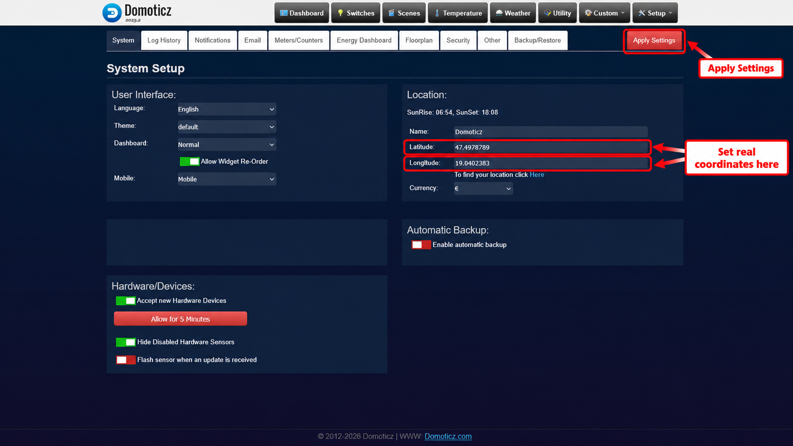
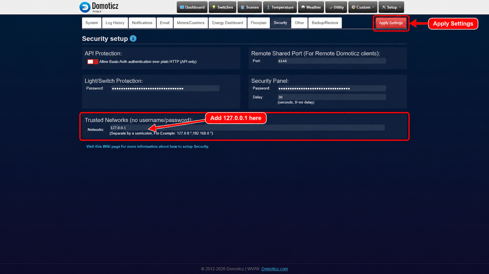
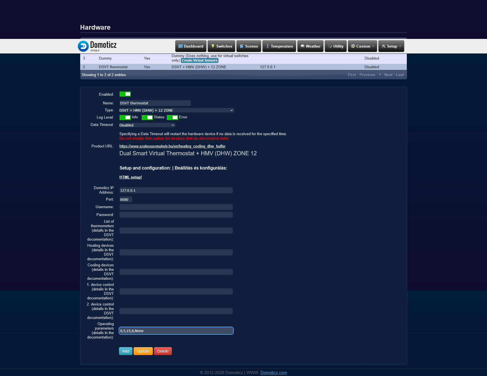
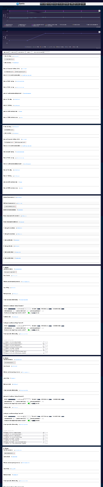

# DSVT – Smart Heating, Cooling and DHW Control for Domoticz

DSVT is an advanced multi-zone heating, cooling and domestic hot water control system for Domoticz, designed primarily for the automation of existing residential buildings.

It is not simply a thermostat controller. The system can coordinate multiple heating and cooling zones, multiple heat sources, domestic hot water production, buffer tanks, mixing valves, energy consumption and production, weather data, presence information, and door/window states.

The goal is not only to provide a control algorithm, but to deliver a ready-to-use automation system. DSVT therefore automatically creates a significant part of the required Domoticz devices and control elements and makes them available on the Domoticz dashboard.

The system is designed to operate locally in an open environment without requiring the user to build the complete control logic from scratch.

## Main Features

### Multi-zone heating and cooling

- Up to 12 independent heating/cooling zones
- Individual room temperature control
- Manual selection between heating and cooling mode
- TRV thermostatic radiator valve control
- Support for underfloor heating, radiators, wall heating/cooling and ceiling heating/cooling
- Automatically calculated target temperatures
- Door and window opening detection per zone
- Heating or cooling demand of a zone can be ignored while a window or door is open

### Multiple heat sources

DSVT can coordinate multiple heat sources, for example:

- Heat pumps
- Gas boilers
- Electric heating
- Other auxiliary heat sources

The system can coordinate the heat sources according to heat demand and system configuration.

It is especially suitable for hybrid systems, for example when a heat pump is added to an existing gas boiler.

### Outdoor-temperature-based target temperature

To improve heat pump efficiency, DSVT can adjust target temperatures according to the outdoor temperature.

This can be used for:

- Heating supply target temperature
- DHW target temperature

Lower target temperatures can be used during milder weather and higher target temperatures during colder conditions, helping the heat pump operate under more favorable conditions.

### Domestic Hot Water control

DHW control is an integral part of the system.

Main features include:

- DHW temperature control
- Multiple heat source support
- Heat pump DHW production
- Boiler-based DHW production
- Electric immersion heater control
- Scheduled operation
- Coordinated use of heat sources
- Outdoor-temperature-dependent DHW target temperature
- Scheduled thermal disinfection heating using the electric immersion heater

The scheduled disinfection cycle can periodically raise the DHW tank to a higher temperature.

### Buffer tank control

The system can use buffer tank temperature data as part of the heating and cooling control strategy.

The buffer state can be used to coordinate heat source operation and reduce unnecessary switching.

### Mixing valve control

DSVT can control two independent mixing valves.

This allows different supply temperatures to be used for different heat distribution systems, for example:

- Underfloor heating
- Radiators
- Wall heating
- Ceiling heating
- Ceiling cooling
- Wall cooling

Mixing valve target temperatures can be adjusted according to current system demand.

### Dew point monitoring in cooling mode

During cooling operation, the system can take the dew point into account.

The purpose is to reduce the risk of condensation when surface cooling is used and to prevent the cooling water temperature from falling below a safe level.

### Health-related cooling limit

In cooling mode, DSVT can automatically apply a configurable health-related cooling limit.

The purpose is to avoid an unnecessarily large temperature difference between outdoor and indoor temperatures and therefore prevent excessively aggressive cooling.

### Integration of conventional air conditioners

Traditional split air-conditioning systems can be integrated into the central cooling strategy using infrared control.

This allows conventional air conditioners to operate as part of the overall cooling system instead of as isolated devices.

### Look-ahead control

DSVT does not automatically calculate the thermal inertia of the building.

Instead, the user can configure how far ahead the controller should take expected temperature changes into account.

This makes it possible to adapt the control strategy to systems such as:

- Slow-response underfloor heating
- Faster-response radiator heating
- Buildings with different thermal characteristics

### Weather data

DSVT can use weather forecast information as part of its control strategy.

Forecast data can be used for look-ahead control and for estimating future heating or cooling demand.

The project aims to use an international weather data source that provides at least temperature forecasts worldwide.

### Presence-based control

The system can use presence information to automatically switch between comfort and energy-saving operation.

When nobody is at home, unnecessary heating or cooling can be reduced.

When occupants return, normal comfort settings can automatically be restored.

Presence detection is being made available as a separately installable component so that this functionality will not depend on the Szélessáv SmartHome firmware.

### Door and window opening detection

DSVT can monitor door and window sensors individually for each zone.

When a window or door is open, the heating or cooling demand of the affected room can be ignored.

This helps prevent heating or cooling a room while a window is open.

### Energy consumption and production monitoring

The system can use energy consumption and production data.

This makes it possible to coordinate flexible electrical loads according to factors such as:

- Current photovoltaic production
- Grid power consumption
- Available surplus energy
- Configured power limits

For example, DHW production or other controllable loads can be shifted to more favorable periods.

## Dedicated HTML configuration interface

Because of the large number of functions and configuration options, managing all parameters through standard Domoticz hardware fields would be difficult.

DSVT therefore provides a dedicated HTML administration interface.

The interface can be used to configure, among other things:

- Zones
- Temperature targets
- Heat sources
- Mixing valves
- DHW operation
- Presence logic
- Door and window sensors
- Cooling limits
- Look-ahead time
- Other operating and optimization parameters

The goal is to keep configuration understandable even though the underlying control logic is complex.

## Graphical event log

The administration interface provides a graphical log of the last 24 hours of system events.

This can help with:

- Checking system operation
- Fine-tuning configuration
- Identifying problems
- Optimizing energy use
- Understanding control decisions

## Automatic user interface creation

For easier everyday use, DSVT automatically creates and places a significant part of the required control elements on the Domoticz dashboard.

These may include:

- Operating mode selectors
- Target temperature controls
- Zone controls
- Heat source status indicators
- DHW controls
- Mixing valve settings
- Presence status
- System status
- Operating and optimization parameters

The goal is that after installation the user is not presented with an empty automation platform, but with a usable and preconfigured control interface.

## Local operation

DSVT is designed to operate locally within Domoticz.

Heating, cooling and DHW control do not require a permanent cloud connection.

The main control logic runs locally.

## Typical system configuration

A typical DSVT installation may include:

- Heat pump
- Gas boiler
- Electric immersion heater
- Multiple heating/cooling zones
- TRVs
- Underfloor heating
- Radiators
- Wall or ceiling heating/cooling
- Conventional split air conditioners
- Buffer tank
- DHW tank
- Two mixing valves
- Indoor temperature sensors
- Outdoor temperature sensor
- Humidity sensors
- Door and window sensors
- Presence detection
- Energy consumption measurement
- Photovoltaic production monitoring
- Weather forecast data

DSVT handles these components as parts of one coordinated control system.

## Intended use

DSVT is primarily designed for automation of existing residential buildings.

It is especially useful where:

- Different heat distribution systems are used
- Multiple heat sources must be coordinated
- A heat pump is added to an existing boiler
- Independent control of multiple rooms is required
- DHW production must also be automated
- Surface cooling and air conditioning are used together
- Photovoltaic generation is available
- Local, cloud-independent operation is important
- The user does not want to build the complete automation logic manually

## Multi-language support

The system interface and Domoticz devices support multiple languages.

Currently supported languages include:

- Chinese
- Czech
- Danish
- Dutch
- English
- Finnish
- French
- German
- Hungarian
- Italian
- Japanese
- Norwegian
- Polish
- Portuguese
- Spanish
- Swedish

The system can create devices and interface elements according to the language configured in Domoticz.

## Requirements

- Domoticz 2023.2 or newer
- Python plugin support
- Compatible temperature, humidity and other sensors
- Switching and control devices suitable for the HVAC system

The system has so far been primarily tested and used in an OpenWrt environment.

Testing on other Linux-based Domoticz systems is welcome.

## Installation

## Required Domoticz settings before first startup

Before starting DSVT for the first time, configure the following two settings in Domoticz. Both are necessary for correct operation.

### 1. Set your actual geographic location

Go to **Setup → Settings → System → Location** and enter the real latitude and longitude of the installation site.

DSVT uses these coordinates for location-dependent weather information and heating/cooling calculations. Missing or incorrect coordinates may produce inaccurate results. Do not rely on the plugin's fallback location for normal operation.



### 2. Allow local Domoticz API access

Go to **Setup → Settings → Security → Trusted Networks (no username/password)** and add:

`127.0.0.1`

DSVT calls the local Domoticz API to create and update user variables and perform other operations. Without this exception, these requests may return **HTTP 401 Unauthorized**, preventing parts of DSVT from working. Allow only the required loopback address; do not disable authentication for other networks.



Save both settings before the first DSVT startup.

Clone the repository into the Domoticz plugin directory:

```sh
cd /etc/domoticz/plugins
git clone https://github.com/szelessavalapitvany/Domoticz-DSVT.git DSVT_HMV_ZONE_12
cp -r /etc/domoticz/plugins/DSVT_HMV_ZONE_12/viewer/* /usr/share/domoticz/www/templates/
```


### Configure DSVT using the Custom HTML interface

**Important: First create the DSVT hardware entry in Domoticz with an empty configuration.** Go to **Setup → Hardware**, select **DSVT + HMV (DHW) + 12 ZONE**, enter a name, keep the required Domoticz connection settings (IP address and port) correct, leave the heating/cooling device lists and other optional configuration fields empty, then click **Add**. Do not attempt the detailed setup in this standard hardware form: it is only used to create and start the plugin.

**The DSVT HTML setup becomes available only after the plugin has been added.** Once the hardware entry exists, perform the full heating, cooling, DHW and zone configuration through the dedicated HTML interface under **Custom**.



Open **Custom → HTML setup!** to access the DSVT configuration interface.



**Check user permissions:** The account used to configure DSVT must be allowed to view the **Custom** menu. This access is not enabled by default for every user. If **Custom** is missing, have a Domoticz administrator grant the account the necessary permissions before continuing.

Detailed information: https://www.szelessavmuhely.hu/en/heating_cooling_dhw_buffer


# DSVT – intelligens fűtés-, hűtés- és HMV-vezérlés Domoticzhoz

A DSVT egy fejlett, többzónás fűtés-, hűtés- és használati melegvíz-vezérlő rendszer Domoticzhoz, amely elsősorban meglévő családi házak automatizálására készült.

Nem egyszerű termosztátvezérlésről van szó. A rendszer képes összehangolni több fűtési és hűtési zónát, több hőforrást, a használati melegvíz-készítést, puffertartályt, keverőszelepeket, az energiafogyasztást és -termelést, az időjárási adatokat, a jelenlét-információt, valamint az ajtók és ablakok állapotát.

A cél nem csupán egy vezérlőalgoritmus biztosítása, hanem egy használatra kész automatizálási rendszer létrehozása. A DSVT ezért a szükséges Domoticz-eszközök és kezelőelemek jelentős részét automatikusan létrehozza, és elérhetővé teszi azokat a Domoticz kezdőoldalán.

A rendszer helyi működésre készült, nyílt környezetben, anélkül hogy a felhasználónak saját magának kellene felépítenie a teljes vezérlési logikát.

## Főbb funkciók

### Többzónás fűtés és hűtés

- Legfeljebb 12 önálló fűtési/hűtési zóna
- Helyiségenkénti hőmérséklet-szabályozás
- Kézzel választható fűtési vagy hűtési üzemmód
- TRV termosztatikus radiátorszelepek vezérlése
- Padlófűtés, radiátoros fűtés, fal- és mennyezetfűtés/hűtés támogatása
- Automatikusan számított célhőmérsékletek
- Ajtó- és ablaknyitás érzékelése zónánként
- Nyitott ajtó vagy ablak esetén az adott zóna fűtési vagy hűtési igénye figyelmen kívül hagyható

### Több hőforrás kezelése

A DSVT több különböző hőforrás összehangolt vezérlésére képes, például:

- hőszivattyú
- gázkazán
- elektromos fűtés
- egyéb kiegészítő hőforrás

A rendszer a hőigény és a beállított rendszerkonfiguráció alapján képes összehangolni a különböző hőforrások működését.

Kifejezetten alkalmas hibrid rendszerekhez, például amikor egy meglévő gázkazán mellé hőszivattyú kerül.

### Külső hőmérséklet alapján változó célhőmérséklet

A hőszivattyú hatékonyabb működésének elősegítésére a DSVT a külső hőmérséklet alapján képes változtatni a célhőmérsékleteket.

Ez használható:

- a fűtési előremenő célhőmérséklet meghatározására
- a HMV célhőmérséklet meghatározására

Enyhébb időben alacsonyabb, hidegebb időben magasabb célhőmérséklet használható, ami kedvezőbb üzemi körülményeket biztosíthat a hőszivattyú számára.

### Használati melegvíz-vezérlés

A HMV-vezérlés a rendszer szerves része.

Főbb funkciói:

- HMV-hőmérséklet szabályozása
- több hőforrás támogatása
- hőszivattyús HMV-készítés
- kazános HMV-készítés
- elektromos fűtőpatron vezérlése
- időzített működés
- hőforrások összehangolt használata
- külső hőmérséklet alapján változó HMV célhőmérséklet
- időzített fertőtlenítő felfűtés elektromos fűtőpatronnal

Az időzített fertőtlenítő felfűtés segítségével a HMV-tartály időszakosan magasabb hőmérsékletre fűthető.

### Puffertartály kezelése

A rendszer képes a puffertartály hőmérsékleti adatait a fűtési és hűtési vezérlés részeként felhasználni.

A puffer állapota felhasználható a hőforrások működésének összehangolására és a szükségtelen kapcsolgatások csökkentésére.

### Keverőszelepek vezérlése

A DSVT két egymástól független keverőszelep vezérlésére képes.

Ez lehetővé teszi eltérő előremenő hőmérsékletek használatát különböző hőleadó rendszereknél, például:

- padlófűtés
- radiátoros fűtés
- falfűtés
- mennyezetfűtés
- mennyezethűtés
- falhűtés

A keverőszelepek célhőmérséklete a rendszer aktuális igényeihez igazítható.

### Harmatpontfigyelés hűtési üzemben

Hűtési üzemben a rendszer képes figyelembe venni a harmatpontot.

Ennek célja, hogy felülethűtés esetén csökkentse a páralecsapódás kockázatát, és megakadályozza, hogy a hűtővíz hőmérséklete a biztonságos érték alá csökkenjen.

### Egészségügyi hűtési határérték

Hűtési üzemben a DSVT automatikusan képes alkalmazni a beállított egészségügyi hűtési határértéket.

Ennek célja, hogy ne alakuljon ki indokolatlanul nagy hőmérséklet-különbség a külső és belső hőmérséklet között, és ezáltal elkerülhető legyen a túlzottan intenzív hűtés.

### Hagyományos légkondicionálók integrálása

Hagyományos split klímaberendezések IR-vezérléssel integrálhatók a központi hűtési rendszerbe.

Így a légkondicionálók nem különálló készülékként, hanem a teljes hűtési rendszer részeként működhetnek.

### Előretekintő vezérlés

A DSVT nem számítja automatikusan az épület termikus tehetetlenségét.

Ehelyett beállítható, hogy a vezérlés mennyivel előre vegye figyelembe a várható hőmérséklet-változásokat.

Így a működés hozzáigazítható például:

- lassú reakciójú padlófűtéshez
- gyorsabban reagáló radiátoros fűtéshez
- eltérő termikus tulajdonságú épületekhez

### Időjárási adatok

A DSVT képes időjárás-előrejelzési adatokat felhasználni a vezérlés részeként.

Az előrejelzési adatok felhasználhatók az előretekintő szabályozásban, valamint a várható fűtési vagy hűtési igény becslésében.

A projekt célja olyan nemzetközi időjárási adatforrás használata, amely világszerte legalább hőmérséklet-előrejelzést biztosít.

### Jelenlétalapú vezérlés

A rendszer jelenlét-információ alapján automatikusan képes váltani komfort és energiatakarékos működés között.

Ha senki nincs otthon, csökkenthető a szükségtelen fűtés vagy hűtés.

Hazatéréskor a normál komfortbeállítások automatikusan visszaállíthatók.

A jelenlétérzékelés külön telepíthető komponensként is elérhetővé válik, így ez a funkció nem lesz a Szélessáv SmartHome firmware használatához kötve.

### Ajtó- és ablaknyitás érzékelése

A DSVT minden zónában külön képes figyelni az ajtó- és ablakérzékelők állapotát.

Nyitott ajtó vagy ablak esetén az érintett helyiség fűtési vagy hűtési igénye figyelmen kívül hagyható.

Ez megakadályozza, hogy a rendszer nyitott ablak mellett próbálja fűteni vagy hűteni a helyiséget.

### Energiafogyasztás és energiatermelés figyelése

A rendszer képes energiafogyasztási és energiatermelési adatokat is felhasználni.

Ez lehetővé teszi egyes rugalmasan vezérelhető fogyasztók működésének összehangolását többek között az alábbiakkal:

- pillanatnyi napelemes energiatermelés
- hálózati energiafelvétel
- rendelkezésre álló energiatöbblet
- beállított teljesítményhatárok

Így például a HMV-készítés vagy más vezérelhető fogyasztók működése kedvezőbb időszakokra helyezhető át.

## Külön HTML konfigurációs felület

A nagyszámú funkció és konfigurációs lehetőség miatt az összes paraméter kezelése a Domoticz hagyományos hardverbeállítási mezőin keresztül nehezen áttekinthető lenne.

Ezért a DSVT külön HTML adminisztrációs felületet biztosít.

Ezen többek között az alábbiak konfigurálhatók:

- zónák
- célhőmérsékletek
- hőforrások
- keverőszelepek
- HMV működése
- jelenléti logika
- ajtó- és ablakérzékelők
- hűtési határértékek
- előretekintési idő
- egyéb működési és optimalizálási paraméterek

A cél az, hogy az összetett vezérlési logika ellenére a rendszer konfigurációja átlátható maradjon.

## Grafikus eseménynapló

Az adminisztrációs felületen grafikusan megtekinthető az elmúlt 24 óra rendszereseményeinek naplója.

Ez segítséget nyújt:

- a rendszer működésének ellenőrzéséhez
- a beállítások finomhangolásához
- a hibák felismeréséhez
- az energiafelhasználás optimalizálásához
- a vezérlési döntések visszakövetéséhez

## Automatikus kezelőfelület-kialakítás

A kényelmes mindennapi használat érdekében a DSVT automatikusan létrehozza és a Domoticz kezdőoldalára helyezi a szükséges kezelőelemek jelentős részét.

Ezek többek között lehetnek:

- üzemmódválasztók
- célhőmérséklet-beállítások
- zónavezérlők
- hőforrások állapotjelzései
- HMV-vezérlők
- keverőszelep-beállítások
- jelenléti állapot
- rendszerállapotok
- működési és optimalizálási paraméterek

A cél az, hogy a telepítés után a felhasználó ne egy üres automatizálási platformot kapjon, hanem egy használható és előkészített kezelőfelületet.

## Helyi működés

A DSVT helyi működésre készült Domoticz környezetben.

A fűtés-, hűtés- és HMV-vezérlés nem igényel állandó felhőkapcsolatot.

A rendszer fő vezérlési logikája helyben fut.

## Tipikus rendszerfelépítés

Egy tipikus DSVT rendszer például az alábbi elemekből állhat:

- hőszivattyú
- gázkazán
- elektromos fűtőpatron
- több fűtési/hűtési zóna
- TRV szelepek
- padlófűtés
- radiátorok
- fal- vagy mennyezeti fűtés/hűtés
- hagyományos split klímaberendezések
- puffertartály
- HMV-tartály
- két keverőszelep
- beltéri hőmérséklet-érzékelők
- külső hőmérséklet-érzékelő
- páratartalom-érzékelők
- ajtó- és ablakérzékelők
- jelenlétérzékelés
- energiafogyasztás-mérés
- napelemes energiatermelés figyelése
- időjárás-előrejelzési adatok

A DSVT ezeket nem különálló eszközökként, hanem egyetlen összehangolt vezérlési rendszer részeként kezeli.

## Mire készült?

A DSVT elsősorban meglévő családi házak automatizálására készült.

Különösen hasznos olyan rendszereknél, ahol:

- többféle hőleadó rendszer működik
- több hőforrást kell összehangolni
- meglévő kazán mellé hőszivattyú kerül
- több helyiség önálló szabályozása szükséges
- a HMV-készítést is automatizálni kell
- felülethűtés és légkondicionálás együttesen működik
- napelemes energiatermelés áll rendelkezésre
- fontos a helyi, felhőtől független működés
- a felhasználó nem szeretné saját maga felépíteni a teljes automatizálási logikát

## Többnyelvű támogatás

A rendszer kezelőfelülete és a Domoticzban létrehozott eszközök több nyelvet támogatnak.

Jelenleg támogatott nyelvek:

- angol
- cseh
- dán
- finn
- francia
- holland
- japán
- kínai
- lengyel
- magyar
- német
- norvég
- olasz
- portugál
- spanyol
- svéd

A rendszer a Domoticzban beállított nyelv alapján képes létrehozni az eszközöket és a kezelőfelület elemeit a megfelelő nyelven.

## Követelmények

- Domoticz 2023.2 vagy frissebb
- Python plugin támogatás
- kompatibilis hőmérséklet-, páratartalom- és egyéb érzékelők
- az adott HVAC rendszerhez megfelelő kapcsoló- és szabályozóeszközök

A rendszer eddig elsősorban OpenWrt környezetben lett tesztelve és használva.

Más Linux-alapú Domoticz rendszereken végzett tesztelést szívesen fogadunk.

## Telepítés

### Kötelező Domoticz-beállítások az első indítás előtt

A DSVT első indítása előtt a Domoticzban az alábbi két beállítást el kell végezni. Mindkettő szükséges a megfelelő működéshez.

#### 1. Valós földrajzi koordináták megadása

A **Setup → Settings → System → Location** menüpontban add meg a telepítés helyének valós földrajzi szélességét és hosszúságát.

A DSVT ezeket használja a helyfüggő időjárási adatokhoz és a fűtési/hűtési számításokhoz. Hiányzó vagy pontatlan koordináták esetén a számítások hibásak lehetnek. Normál használat során ne hagyatkozz a program tartalék koordinátáira.


#### 2. Helyi Domoticz API-hozzáférés engedélyezése

A **Setup → Settings → Security → Trusted Networks (no username/password)** mezőbe vedd fel ezt a címet:

`127.0.0.1`

A DSVT a helyi Domoticz API-n keresztül hozza létre és frissíti többek között a felhasználói változókat. A fenti engedély nélkül a kérések **HTTP 401 Unauthorized** hibával elutasításra kerülhetnek, így a rendszer bizonyos funkciói nem működnek. Csak a szükséges helyi címet engedélyezd, más hálózatoknál ne kapcsold ki a hitelesítést.


Mindkét beállítást mentsd el, mielőtt először elindítod a DSVT-t.

A repository-t a Domoticz plugin könyvtárába kell klónozni:

```sh
cd /etc/domoticz/plugins
git clone https://github.com/szelessavalapitvany/Domoticz-DSVT.git DSVT_HMV_ZONE_12
```

### HTML adminisztrációs felület telepítése

A DSVT HTML adminisztrációs felülete a rendszer fontos része.

A `viewer` könyvtár teljes tartalmát át kell másolni a Domoticz `templates` könyvtárába:

```sh
cp -r /etc/domoticz/plugins/DSVT_HMV_ZONE_12/viewer/* /usr/share/domoticz/www/templates/
```

Ez a lépés szükséges a DSVT saját konfigurációs és grafikus adminisztrációs felületének használatához.

### Domoticz újraindítása

A telepítés után újra kell indítani a Domoticz szolgáltatást.

OpenWrt alatt:

```sh
/etc/init.d/domoticz restart
```


### A DSVT beállítása a Custom menü HTML-felületén

**Fontos: először a DSVT plugint üres konfigurációval létre kell hozni a Domoticzban!** A **Setup → Hardware** oldalon válaszd ki a **DSVT + HMV (DHW) + 12 ZONE** típust, adj nevet, ellenőrizd a Domoticz csatlakozási adatokat (IP-cím, port), a fűtési/hűtési eszközlistákat és a többi opcionális konfigurációs mezőt hagyd üresen, majd kattints az **Add** gombra. A részletes beállításokat ne ezen a hagyományos hardverűrlapon próbáld elvégezni: itt csak létrehozzuk és elindítjuk a plugint.

**A DSVT HTML setup felülete csak a plugin létrehozása után válik elérhetővé.** Ezután a fűtés, hűtés, HMV és a zónák részletes konfigurációját a **Custom** menüben kell elvégezni.


A részletes konfigurációhoz nyisd meg a **Custom → HTML setup!** menüpontot.


**Ellenőrizd a jogosultságokat!** A DSVT-t konfiguráló felhasználónak rendelkeznie kell a **Custom** menü megtekintéséhez szükséges jogosultsággal. Ez alapértelmezés szerint nem minden felhasználó számára engedélyezett. Ha a **Custom** menü nem jelenik meg, a Domoticz rendszergazdájával engedélyeztetni kell a megfelelő hozzáférést.

## Frissítés

A plugin frissítéséhez:

```sh
cd /etc/domoticz/plugins/DSVT_HMV_ZONE_12
git pull
```


A `viewer` könyvtár tartalmát frissítés után is újra át kell másolni, mert az adminisztrációs felület fájljai is változhatnak:

```sh
cp -r viewer/* /usr/share/domoticz/www/templates/
```

Ezután újra kell indítani a Domoticz szolgáltatást:

```sh
/etc/init.d/domoticz restart
```


## Beállítás és konfiguráció

A rendszer részletes beállítási, konfigurációs és működési dokumentációja itt található:

https://www.szelessavmuhely.hu/hu/futes_hutes_hmv_puffer

## Projekt állapota

A projekt jelenleg nyilvános tesztelésre készül.

A rendszer OpenWrt + Domoticz környezetben már használatban van, de a szélesebb körű és nemzetközi kiadás előtt különösen hasznos a tesztelés:

- különböző Domoticz verziókkal
- különböző Linux környezetekben
- eltérő fűtési és hűtési rendszerekkel
- különböző hőforrás-kombinációkkal
- különböző ország- és nyelvi beállításokkal

A hibák, észrevételek és teszteredmények a GitHub Issues felületén jelezhetők.

## Licenc

A projekt MIT licenc alatt érhető el.
